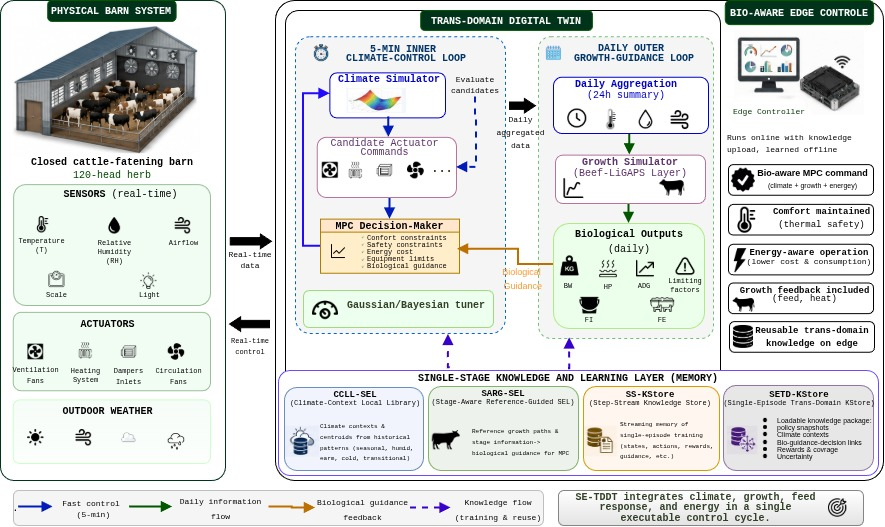

# TDDT Livestock — Trans-Domain Digital Twin Optimizer



# SE-TDDT for Energy-Efficient Cattle Fattening Barns

The article **“A Trans-Domain Digital Twin for Bio-Aware Control of Climate and Energy in Cattle Fattening Barns Using Single-Episode Optimizer Learning”** presents a Trans-Domain Digital Twin framework, referred to as **SE-TDDT**, for intelligent management of enclosed cattle fattening barns.

The main idea is that barn climate, energy consumption, and animal growth should not be treated as independent problems. Temperature, humidity, airflow, and ventilation directly affect thermal comfort, feed intake, metabolic heat production, Average Daily Gain, and feed efficiency. At the same time, increasing animal body weight changes the metabolic heat load and consequently affects the future ventilation and heating requirements of the barn.

Within this framework, a **five-minute fast control loop** predicts barn climate conditions and actuator commands, including ventilation and heating systems. A **Model Predictive Control (MPC)** strategy then selects control actions that balance animal comfort, operational safety, energy consumption, and biological priorities.

In parallel, a **daily biological loop** evaluates body-weight evolution, Average Daily Gain, feed intake, feed efficiency, metabolic heat production, and growth-limiting factors. These biological indicators are then fed back into the climate-control process. Therefore, environmental regulation is no longer limited to HVAC optimization alone, but becomes directly connected to improving fattening conditions and reducing unnecessary energy consumption.

In the reported evaluation for an enclosed barn containing **120 cattle**, the system maintained thermal comfort with **0% comfort-zone violations**. The reported growth performance reached **96.91%**, while energy performance reached **92.61%**. Over the 1,000-day simulation trajectory, the final body weight approached approximately **917 kg**.

These results demonstrate that the integrated optimization of climate, energy, feed-related conditions, and animal growth can provide a practical foundation for smart cattle fattening barns seeking both improved biological performance and more targeted energy use.

The framework also stores knowledge obtained from a long optimization episode in a structured knowledge memory, allowing the edge controller to reuse learned operating knowledge without requiring GPU acceleration or continuous cloud computation. However, the study also indicates that feed-pressure management, actuator-command smoothing, and real-world field validation remain important areas for further improvement.

## Article

https://doi.org/10.48550/arXiv.2608.27185

---


# SE-TDDT pour des étables d’engraissement bovin à haute efficacité énergétique

L’article **« A Trans-Domain Digital Twin for Bio-Aware Control of Climate and Energy in Cattle Fattening Barns Using Single-Episode Optimizer Learning »** présente un cadre de jumeau numérique transdomaine, appelé **SE-TDDT**, destiné à la gestion intelligente des étables fermées d’engraissement bovin.

L’idée principale consiste à ne pas considérer séparément le climat intérieur, la consommation énergétique et la croissance des animaux. La température, l’humidité, les flux d’air et la ventilation influencent directement le confort thermique, la consommation alimentaire, la production de chaleur métabolique, le gain moyen quotidien, ainsi que l’efficacité alimentaire. Parallèlement, l’augmentation du poids corporel des animaux modifie la charge thermique métabolique et influence donc les besoins futurs de l’étable en ventilation et en chauffage.

Dans ce cadre, une **boucle de contrôle rapide fonctionnant toutes les cinq minutes** prédit l’état climatique de l’étable ainsi que les commandes des actionneurs, notamment les systèmes de ventilation et de chauffage. Une stratégie de **commande prédictive basée sur un modèle, Model Predictive Control (MPC)**, sélectionne ensuite les actions permettant de trouver un compromis entre confort animal, sécurité opérationnelle, consommation énergétique et priorités biologiques.

En parallèle, une **boucle biologique quotidienne** évalue l’évolution du poids corporel, le gain moyen quotidien, l’ingestion alimentaire, l’efficacité alimentaire, la production de chaleur métabolique et les facteurs limitant la croissance. Ces informations biologiques sont ensuite réinjectées dans le processus de contrôle climatique. La régulation de l’environnement intérieur n’est donc plus limitée à l’optimisation du système HVAC, mais devient directement liée à l’amélioration des conditions d’engraissement et à la réduction des dépenses énergétiques inutiles.

Dans l’évaluation présentée pour une étable fermée accueillant **120 bovins**, le système a maintenu le confort thermique avec **0 % de violation de la zone de confort**. Les performances de croissance ont atteint **96,91 %**, tandis que les performances énergétiques ont atteint **92,61 %**. Sur une trajectoire de simulation de 1 000 jours, le poids corporel final a atteint environ **917 kg**.

Ces résultats montrent que l’optimisation intégrée du climat, de l’énergie, des conditions liées à l’alimentation et de la croissance animale peut constituer une base pertinente pour des étables d’engraissement intelligentes recherchant simultanément de meilleures performances biologiques et une utilisation plus ciblée de l’énergie.

Le cadre conserve également les connaissances acquises lors d’un long épisode d’optimisation dans une mémoire structurée. Le contrôleur exécuté en périphérie peut ainsi réutiliser ces connaissances sans nécessiter de GPU ni de calcul cloud permanent. L’étude souligne toutefois que la gestion de la pression alimentaire, le lissage des commandes des actionneurs et la validation dans des conditions réelles d’exploitation restent des axes importants d’amélioration.

## Article

https://doi.org/10.48550/arXiv.2608.27185

---
This package is a trans-domain digital twin optimizer for livestock housing that connects two existing simulators in two time loops without changing the core logic:

- **Climate inner loop** with 5-minute step: Get state from `funnel` or `simulator_funnel`, choose actuator command by Economic-MPC, safety filter, call climate simulator and record decisions.
- **Growth outer loop** with daily step: Integrate 5-minute climate into daily LiGAPS-Beef input, run `growth_simulator/run_growth_endOf_cycle.py` via library API, convert growth output and `heat_production` into guidance for climate loop.

The basic structure of the simulators is preserved:

- Climate: `climate_simulator/main.py` and API/Cython available in `climate_hall_simulator`.
- Growth: `growth_simulator/ligaps_growth_library.py` and `run_growth_endOf_cycle`.
- Hardware funnel: Cython skeleton in `funnel/funnel_core.pyx`, with software replacement `SimulatorFunnel` for `WORK-OFFLINE`.

## Added structure

```text
tddt_optimizer/
cli.py # Main command input
config.py # JSON configuration and paths
adapters/
climate_adapter.py # Call climate wrapper
growth_adapter.py # Call growth API
preprocessing/
openweather_resampler.py # Convert 1-hour OpenWeather to 5-minute
aggregation/
daily_climate_aggregator.py # Convert 5-minute to daily LiGAPS schema
optimizer/
economic_mpc.py # Simple and extensible economic MPC
safety_filter.py # Actuator constraints and fan/damper pairing
funnel/
funnel_core.pyx # Cython component for command packaging and health-check
simulator_funnel.py # Real funnel replacement in offline mode
database/
sqlite_store.py # SQLite runtime memory
evaluation/
reports.py # CSV/JSON/HTML reports
```

## Complete installation, compilation and preparation

Installation of operating system prerequisites:

```bash
chmod +x ./requirements.sh
./requirements.sh
```
Run from the project root:

```bash
./prepare_tddt.sh
```

This script does the following:

1. Install packages and dependencies from `pyproject.toml`: `pandas`, `numpy`, `Cython`, `matplotlib`.
2. Compile the Cython part of the optimizer (`funnel/funnel_core.pyx`).
3. Compile the Python/Cython wrapper of the climate simulator with the command in `climate_simulator/README.md`.
4. If `cmake` is available, build the C++ binaries of the climate simulator in `climate_simulator/build_updated`.
5. Generate the default config in `tddt_optimizer/configs/optimizer.json`.
6. Prepare the entire existing dataset `dataset/CR_7R7_ZARGAR_36085925_50391289.csv`:
- 5-minute output: `prepared/climate_5m_all_rows.csv`
- Daily growth output: `prepared/growth_daily_all_rows.csv`

## Prepare the dataset manually

```bash
python3 -m tddt_optimizer prepare-dataset \
  --growth-start-date 2015-01-01
```

The available OpenWeather input is hourly. Continuous columns such as temperature, humidity, wind, pressure and cloud are converted to 5 minutes by time interpolation. Then for LiGAPS-Beef, daily data is constructed:

- `mint`: daily minimum temperature
- `maxt`: daily maximum temperature
- `wind`: average wind speed
- `rad`: daily radiation estimate from radiation/cloud proxy
- `rain`: daily precipitation
- `vpr`: estimated vapor pressure
- `aha`: default indoor-surrogate constant
- `okta`: cloud cover conversion to 0-8 scale
- `is_observed`: equal to 1 for available data

## TRAIN execution

In this case, the real funnel is disabled and `SimulatorFunnel` builds the state from the prepared dataset. The climate simulator is used both for MPC decision prediction and for the closed-loop test environment.

Example of a full day run with a 5-minute step:

```bash
python3 -m tddt_optimizer train \
  --growth-start-date 2016-07-15 \
  --growth-end-date 2016-07-15 \
  --case-id 1
```

Example of running a multi-day period with a lighting schedule of 14 hours on, 10 hours off, lighting starting at 08:30 AM:

```bash
python3 -m tddt_optimizer train \
  --growth-start-date 2016-11-25 \
  --growth-end-date 2016-12-02 \
  --light-hours-on 14 \
  --light-hours-off 10 \
  --light-on-hour 8 \
  --light-on-minute 30 \
  --case-id 1
```
For an exact 1000-day interval by date:

```bash
python3 -m tddt_optimizer train \
  --growth-start-date 2016-07-15 \
  --max-steps 288000 \
  --case-id 1 \
  --light-on-hour 8 \
  --light-on-minute 30 \
  --light-hours-on 14 \
  --light-hours-off 10
```
No off time and artificial light method
```bash
  python3 -m tddt_optimizer train \
  --growth-start-date 2016-07-15 \
  --max-steps 288000 \
  --case-id 1
```

For the exact 1000-day interval by steps:

```bash
python3 -m tddt_optimizer train \
  --growth-start-date 2016-07-15 \
  --growth-end-date 2019-04-10 \
  --case-id 1 \
  --light-on-hour 8 \
  --light-on-minute 30 \
  --light-hours-on 14 \
  --light-hours-off 10
```


If you want to prepare a specific dataset manually, do so in the `prepare-dataset` step, not in `train`:

```bash id="8ip2v1"
python3 -m tddt_optimizer prepare-dataset \
  --dataset dataset/CR_7R7_ZARGAR_36085925_50391289.csv \
  --growth-start-date 2016-07-15 \
  --out-5m prepared/climate_5m_all_rows.csv \
  --out-daily prepared/growth_daily_all_rows.csv
```

then:

```bash id="4u9znl"
python3 -m tddt_optimizer prepare-ccll-sel \
  --prepared-5m prepared/climate_5m_all_rows.csv \
  --output-dir prepared
```

And then run the training:

```bash id="klmxbq"
python3 -m tddt_optimizer train \
  --growth-start-date 2016-07-15 \
  --growth-end-date 2019-04-10 \
  --case-id 1 \
  --light-on-hour 8 \
  --light-on-minute 30 \
  --light-hours-on 14 \
  --light-hours-off 10
```

`train` arguments:

```bash
--growth-start-date
--growth-end-date
--max-steps
--case-id
--no-progress
--light-on-hour
--light-on-minute
--light-hours-on
--light-hours-off
```


Note: `--max-steps` is for controlling the execution time. If omitted or given a large value, running all 5-minute rows may take a long time, because for each step several candidate actuators are evaluated with the climate simulator.

When `WORK-OFFLINE` is run, the progress of the test is displayed in the terminal: test start, number of inner loop steps, percentage progress, dataset time, indoor temperature, comfort zone, ventilation command, heating command, light status, safety status and elapsed time. If the interval is more than one day and less than/equal to one week, the progress is displayed hourly. If the interval is more than one week, the progress is displayed daily. To run without showing progress, `--no-progress` can be used.

After the run is finished, reports are created in the `reports/` folder:

- `reports/inner_loop_log.csv`: state, forecast, temperature, humidity, comfort band and energy
- `reports/actuator_commands.csv`: all actuator decisions
- `reports/outer_growth_state.csv`: growth loop output
- `reports/validation_summary.json`: validation summary metrics
- `reports/validation_chart_data.json`: chart data for Chart.js report
- `reports/validation_report.html`: HTML report based on Chart.js including indoor/outdoor temperature and comfort band charts, indoor/outdoor humidity, indoor/outdoor wind, actuator decision, energy, RMSE/MEAN/MAE/MSE/R2/RMSE÷MEAN accuracy metrics with excellent/good/average/poor color levels, daily/weekly/monthly/yearly charts and all growth numerical parameters
- `reports/growth_outputs/`: growth simulator output reports

The main indicators of the report include: `time_in_comfort_band_rate`, `comfort_violation_rate`, `below_band_rate`, `above_band_rate`, `temp_rmse_to_band_center_c`, `mean_normalized_comfort_error`, average indoor/outdoor temperature, indoor/outdoor humidity, indoor/outdoor wind, average heating and ventilation command, number of actuator changes, electric energy index, gas energy index, latest growth state and the accuracy indicators `RMSE`, `MEAN`, `MAE`, `MSE`, `R2`, `RMSE / MEAN` and `accuracy_score`.

The SQLite runtime is also stored in the `tddt_runtime.sqlite` file.


### New CLI options in WORK-OFFLINE

- `--growth-end-date`: Optional end date/time. If only a date is given, it is considered to be the same day until 23:59:59.
- `--light-on-hour`: Hour the lights will be on, 0 to 23.
- `--light-on-minute`: Minute the lights will be on, 0 to 59.
- `--light-hours-on`: Hours the lights will be on.
- `--light-hours-off`: Hours the lights will be off; kept for traceability and reporting.

## WORK-ONLINE implementation

In this case, the start date of the growth period is received and the online execution path is enabled with `funnel`. In the current package, the actual LoRa/GPIO layer is safely abstracted and the base class only performs software health-check and command-ACK to avoid errors on a hardware-less development system. For Orange Pi 5, the actual LoRa/GPIO driver needs to be added in `funnel/gpio_driver.py` and `funnel/lora_driver.py`.

```bash
python3 -m tddt_optimizer work-online \
  --growth-start-date 2016-07-15 \
  --max-steps 1
```

Expected funnel actuator command:

```text
ventilation_group_pct
heating_group_pct
light_on
mode
timestamp
command_id
safety_status
```

Expected input data from the funnel:

```text
indoor_temp_c
indoor_rh_pct
indoor_air_speed_m_s
indoor_co2_ppm
indoor_nh3_ppm
indoor_h2o_g_m3
actuator_ack
fan_status
heater_status
light_status
lora_rssi
packet_status
```

## OUT_SERVICE mode

```bash
python3 -m tddt_optimizer out-service
```

In this case, no actuator is controlled and the output `NO_ACTION`/command is safe.

## Config

Default file:

```text
tddt_optimizer/configs/optimizer.json
```

Important parameters:

- `dt_seconds`: Climate loop step, default 300 seconds.
- `default_breed`, `default_diet`, `default_scale`, `default_sex_animal`, `default_housing`: Growth simulator parameters.
- `candidate_ventilation`, `candidate_heating`: Candidate network for MPC.
- `comfort_weight`, `energy_weight`, `gas_weight`: Cost function weights.

## Current execution contract

1. `WORK-OFFLINE` finds the closest prepared dataset row from the growth start date and runs from that interval.
2. Hourly data is interpolated to 5 minutes.
3. MPC decision is made by searching for limited ventilation/heating candidates.
4. Safety filter keeps actuator percentages in the range 0-100 and applies fan/damper pairing rule with `opposite_damper_group_pct`.
5. Output of growth package is converted to climate guidance, but does not control the actuator directly; it only modifies the climate loop bias/target.

## Quick smoke test execution

```bash
python3 -m tddt_optimizer work-offline \
  --growth-start-date 2016-07-15 \
  --max-steps 12 \
  --case-id 99
```

This command should generate initial reports in `reports/` in a few minutes or less.

## CMake cache relocation note

The entire installation and preparation process is handled centrally via `prepare_tddt.sh`. If the package is extracted or moved to a new path, this script automatically clears the old CMake cache/build from `climate_simulator` and then rebuilds the build from the current path. So no separate manual command is required for the relocation error related to `CMakeCache.txt`.

## SARG-SEL, CCLL-SEL, and SETD-KStore workflow

The package now supports the single-episode knowledge workflow:

1. `prepare-dataset` builds the complete 5-minute climate file and daily growth climate file.
2. `prepare-ccll-sel` builds the Climate Context Local Library from the full local climate history.
3. `prepare-sarg-sel` builds the stage-aware growth reference design library.
4. `work-offline` runs one main offline episode and writes high-frequency logs directly into SQLite using an independent writer thread.
5. `export-setd-kstore` exports the learned single-episode trans-domain knowledge package.

`./prepare_tddt.sh` runs steps 1-3 automatically. `WORK-OFFLINE` exports `models/setd_kstore/` automatically at the end of the run.

Manual commands:

```bash
python3 -m tddt_optimizer prepare-ccll-sel --prepared-5m prepared/climate_5m_all_rows.csv --output-dir prepared
python3 -m tddt_optimizer prepare-sarg-sel --output-dir prepared --diets 1,2,3,4,5 --top-k 3
python3 -m tddt_optimizer export-setd-kstore --sqlite tddt_runtime.sqlite --output-dir models/setd_kstore
```


## Configuration and CCLL-SEL clustering update

Optimizer configuration is centralized in the root-level `optimizer.json` file. Run `./prepare_tddt.sh` to regenerate this file for the current machine path and prepare all datasets.

`CCLL-SEL` now uses nearest-centroid clustering instead of rule-based binning. The generated CCLL files are:

- `prepared/climate_context_local_library.json`
- `prepared/climate_context_daily_descriptors.csv`
- `prepared/climate_5m_ccll_all_rows.csv`

The offline optimizer automatically prefers `prepared/climate_5m_ccll_all_rows.csv` when it exists; otherwise it falls back to `prepared/climate_5m_all_rows.csv`.


## Mode naming update

The previous closed-loop `WORK-OFFLINE` learning run is now invoked as `train`:

```bash
python3 -m tddt_optimizer train --growth-start-date 2016-07-15 --max-steps 288000
```

The new `work-offline` command is an offline learned-policy evaluation/replay mode. It does not use the funnel and does not update the learned model:

```bash
python3 -m tddt_optimizer work-offline --growth-start-date 2016-07-15 --max-steps 2880
```

All runtime data are written first to `database/tddt_runtime.sqlite`; reports and SETD-KStore exports are generated from the database. Package paths in `optimizer.json` are relative to the package root.

### SARG-SEL reference generation

`prepare-sarg-sel` now creates `prepared/sarg_growth_reference_library.json` from growth-simulator outputs. It runs the LiGAPS-Beef growth simulator for each configured diet and builds SARG phase-reference programs from those simulator-generated trajectories. The output is no longer a heuristic design-only library. See `doc/SARG_GROWTH_SIMULATOR_REFERENCE_PATCH.md`.

## Reset learned knowledge

To remove the previously learned episode knowledge and start a clean training run:

```bash
python3 -m tddt_optimizer reset-knowledge
```

Preview the reset without deleting files:

```bash
python3 -m tddt_optimizer reset-knowledge --dry-run
```

By default this removes the runtime SQLite database, `models/setd_kstore/`, RL policy snapshot, and reports, then recreates an empty SQLite database. It preserves prepared CCLL/SARG reference libraries. To remove those prepared reference artifacts too:

```bash
python3 -m tddt_optimizer reset-knowledge --include-prepared-knowledge
```


Added a new command to completely rebuild reports without rerunning the tutorial:
```bash
python3 -m tddt_optimizer rebuild-reports
```
